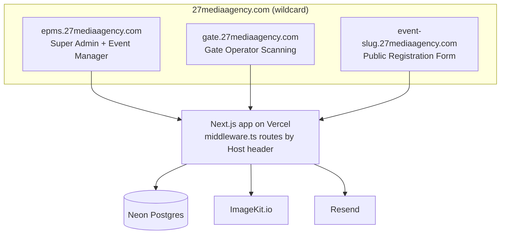
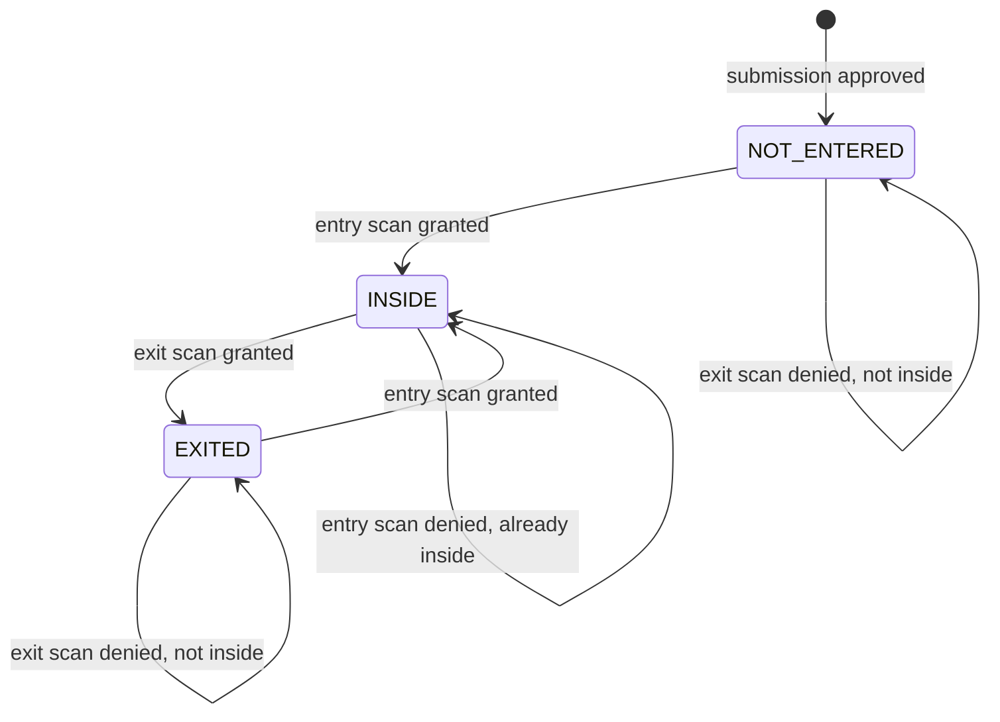

## 1. Mission

You are a senior full-stack engineer building **EVENT-PASS-MANAGEMENT-SYSTEM (EPMS)** — a production-grade, multi-tenant event registration and QR-based gate access control platform, built to a standard fit for real paying customers, not a prototype. Store all source code at the project root: `/EVENT-PASS-MANAGEMENT-SYSTEM`. The finished system must deploy to Vercel with a single `vercel --prod`.

**Never fabricate API keys, secrets, or credentials.** Whenever a required secret is missing (Vercel/GitHub auth, Neon connection string, Resend API key, ImageKit keys), stop and explicitly ask the user to supply it or complete the browser-based login. See Section 13.

Before writing any code, check this project directory for Antigravity skills the user has installed, and use whichever are relevant (scaffolding, deployment, code review, design systems, etc.) throughout the build.

## 2. Tech Stack

| Layer | Choice |
|---|---|
| Framework | Next.js 14+ (App Router), TypeScript |
| Database | Neon (serverless Postgres) |
| ORM | Prisma |
| Styling | Tailwind CSS + a custom design system (Section 11 — do not ship the default template look) |
| Auth | Custom JWT sessions in httpOnly cookies, three separate scopes: super admin, event manager, gate |
| Image storage | ImageKit.io |
| Transactional email | Resend |
| QR generation | `qrcode` (server-side) |
| QR scanning (camera) | `html5-qrcode` or `zxing-js` |
| Email templates | React Email (`@react-email/components`), rendered and sent via Resend |
| Hosting | Vercel, wildcard subdomain routing via `middleware.ts` |

## 3. Domains & Routing

Three subdomains of the same root domain, all served by the same Next.js app — differentiated at runtime by the `Host` header in middleware, not by separate deployments:

- `epms.27mediaagency.com` — Super Admin login + dashboard, Event Manager login + dashboard (same login page, role-based redirect after auth)
- `gate.27mediaagency.com` — Gate operator OTP entry + scanning interface
- `{event-slug}.27mediaagency.com` — Public registration form for one specific event, created dynamically the moment an event manager publishes their form with a slug (e.g. `lymun.27mediaagency.com`)



`middleware.ts` logic: read `Host`. If it starts with `epms.` → serve the EPMS route group. If it starts with `gate.` → serve the gate route group. Any other subdomain → treat it as an event slug, look it up, serve the public-form route group (404 if no active event matches). Root `27mediaagency.com` with no subdomain redirects to `epms.27mediaagency.com`.

## 4. Project Structure

```
/EVENT-PASS-MANAGEMENT-SYSTEM
├── prisma/
│   └── schema.prisma
├── src/
│   ├── middleware.ts              # Host-header routing: epms / gate / event-slug
│   ├── app/
│   │   ├── (epms)/                # epms.27mediaagency.com
│   │   │   ├── login/
│   │   │   ├── admin/             # Super Admin dashboard
│   │   │   └── manager/           # Event Manager dashboard
│   │   ├── (gate)/                # gate.27mediaagency.com
│   │   ├── (public-event)/        # {slug}.27mediaagency.com
│   │   └── api/
│   │       ├── admin/
│   │       ├── manager/
│   │       ├── gate/
│   │       └── public/
│   ├── lib/
│   │   ├── db.ts
│   │   ├── auth.ts
│   │   ├── imagekit.ts
│   │   ├── resend.ts
│   │   └── qr.ts
│   ├── components/
│   └── emails/                    # React Email templates
├── .env.example
├── package.json
└── README.md
```

## 5. Roles & Functional Spec

### 5.1 Super Admin

- Single seeded account (no public signup — see `SUPER_ADMIN_EMAIL` / `SUPER_ADMIN_INITIAL_PASSWORD` in Section 12), forced to change password on first login.
- Can: create an event (name, venue, optional description/date, logo upload, primary/secondary/accent color palette), edit any event, delete any event, list all events with status.
- **Creating an event** auto-generates an Event Manager login ID + a strong random password, hashes the password, and — via Resend, from `no-reply@epms.27mediaagency.com` — emails the credentials plus the login URL (`epms.27mediaagency.com`) to the email address the super admin entered while creating the event. The event manager is forced to change their password on first login.
- **Deleting an event** cascades: removes the event's rows (manager, form fields, submissions, participants, gates, scan logs) and deletes that event's entire media folder from ImageKit (Section 9).

### 5.2 Event Manager

Logs in at `epms.27mediaagency.com` with the emailed credentials → lands on a dashboard scoped to their one event, themed in that event's branding (Section 7). Dashboard sections:

- **Settings** — payment account number, and the phone number where participants will send payment screenshots.
- **Form Builder** — a Google Forms-equivalent builder: add/reorder/remove fields, field types (short text, paragraph, email, number, dropdown, multiple choice, checkboxes, date), required/optional toggle per field. An **Email field is included by default, locked, and always required** — it cannot be deleted, since it's how the QR pass gets delivered later.
- **Publish** — a labelled placeholder input where the manager types a slug (e.g. `lymun`) and presses Enter; this validates slug uniqueness and publishes the form live at `{slug}.27mediaagency.com`.
- **Current Submissions** — every form response, each with **Approve** / **Decline** buttons. The manager checks the payment screenshot they received on their phone (outside the system — this app never receives the screenshot itself) before approving.
  - **Approve**: moves the entry into Participants, generates a unique secure QR token, and emails the QR pass (via Resend).
  - **Decline**: removes it from the active queue. *(Recommended: also send a polite decline email.)*
- **Participants** — the approved list with a live status: **Not Entered / Inside Event / Exited**, searchable. *(Recommended: CSV export, useful as a printed backup list.)*
- **Gates** — create a gate (name + dropdown: Entry Gate / Exit Gate), which generates a Gate OTP. List of gates with the ability to regenerate an OTP.
- **Branding** — read-only preview of the logo/colors the super admin set for this event. Event managers cannot edit branding.

### 5.3 Public Participant Flow

1. Visits `{slug}.27mediaagency.com` — sees the form, themed with the event's logo and colors.
2. Fills it out (email required) and submits.
3. Sees a confirmation page: thank-you message, the payment account number, the phone number to send the screenshot to, and a note that they'll be notified by email once verified.
4. A `Submission` row is created with `status = PENDING`.

### 5.4 Gate Operator Flow

1. Visits `gate.27mediaagency.com`, enters a **Gate OTP**.
2. The app validates it, identifies the event + gate type (Entry/Exit), issues a signed gate-session cookie, and loads that event's branding.
3. Scanning screen:
   - **Primary path**: a hidden, always-focused input field captures scanner input. Hardware barcode/QR scanners register as keyboards and "type" the code fast, followed by Enter — the app watches for that pattern (a fast burst of characters ending in Enter) to tell it apart from a person typing, then submits it as a scan.
   - **Fallback**: if no scanner input arrives within a few seconds, or the operator taps "Use Camera," activate the device camera (`getUserMedia`) with a JS QR decoder — this covers laptops without a scanner (via webcam) and phone logins (via the phone's camera) automatically.
4. Every scan resolves through the state machine in Section 6, and shows a large, glanceable result (big color block, participant name, clear status line) — gate staff read this at a glance during a rush, not by studying a paragraph.

## 6. QR & Entry/Exit State Machine

Each approved participant has one `entryStatus`: `NOT_ENTERED → INSIDE → EXITED → INSIDE → …`



Rules:
- **Entry gate scan**: if status is `NOT_ENTERED` or `EXITED` → allow, set `INSIDE`, log `ENTRY_GRANTED`. If already `INSIDE` → deny, log `ENTRY_DENIED_ALREADY_INSIDE`, show "Already inside" with the original entry time.
- **Exit gate scan**: if status is `INSIDE` → allow, set `EXITED`, log `EXIT_GRANTED`. Otherwise → deny, log `EXIT_DENIED_NOT_INSIDE`, show "Not currently inside the event."
- **Invalid/unknown token**, or a token belonging to a different event than the scanning gate → reject clearly, log `INVALID_QR`. A pass must never validate outside its own event.
- Every scan — granted or denied — writes a `ScanLog` row (participant, gate, result, timestamp) for a full audit trail.

## 7. Branding & Theming

Fields on `Event`: `logoUrl`, `primaryColor`, `secondaryColor`, `accentColor`. Only the super admin sets these. Apply them at runtime as CSS custom properties (a small theme provider reading the current event's values) across:
- the Event Manager dashboard,
- the Gate scanning portal,
- and the public registration form (`{slug}.27mediaagency.com`) — recommended addition, see Section 0.

*(Optional: also thread the logo/colors into the QR-pass email template so the whole experience feels like one branded event, not a generic system email.)*

## 8. Data Model (Prisma)

```prisma
generator client {
  provider = "prisma-client-js"
}

datasource db {
  provider  = "postgresql"
  url       = env("DATABASE_URL")
  directUrl = env("DIRECT_URL")
}

model SuperAdmin {
  id                 String   @id @default(cuid())
  email              String   @unique
  passwordHash       String
  mustChangePassword Boolean  @default(true)
  createdAt          DateTime @default(now())
}

model Event {
  id             String        @id @default(cuid())
  name           String
  venue          String
  eventDate      DateTime?
  description    String?
  slug           String?       @unique
  logoUrl        String?
  logoFileId     String?
  primaryColor   String        @default("#0F172A")
  secondaryColor String        @default("#3B82F6")
  accentColor    String        @default("#F59E0B")
  status         EventStatus   @default(ACTIVE)
  createdAt      DateTime      @default(now())
  updatedAt      DateTime      @updatedAt

  eventManager   EventManager?
  formFields     FormField[]
  submissions    Submission[]
  participants   Participant[]
  gates          Gate[]
}

enum EventStatus {
  ACTIVE
  ARCHIVED
}

model EventManager {
  id                 String   @id @default(cuid())
  eventId            String   @unique
  event              Event    @relation(fields: [eventId], references: [id], onDelete: Cascade)
  loginId            String   @unique
  passwordHash       String
  mustChangePassword Boolean  @default(true)
  accountNumber      String?
  paymentPhone       String?
  contactEmail       String
  createdAt          DateTime @default(now())
}

model FormField {
  id       String    @id @default(cuid())
  eventId  String
  event    Event     @relation(fields: [eventId], references: [id], onDelete: Cascade)
  label    String
  type     FieldType
  required Boolean   @default(false)
  options  Json?
  order    Int
  isLocked Boolean   @default(false)
}

enum FieldType {
  SHORT_TEXT
  PARAGRAPH
  EMAIL
  NUMBER
  DROPDOWN
  RADIO
  CHECKBOX
  DATE
}

model Submission {
  id          String           @id @default(cuid())
  eventId     String
  event       Event            @relation(fields: [eventId], references: [id], onDelete: Cascade)
  responses   Json
  email       String
  status      SubmissionStatus @default(PENDING)
  submittedAt DateTime         @default(now())
  reviewedAt  DateTime?
  participant Participant?
}

enum SubmissionStatus {
  PENDING
  APPROVED
  DECLINED
}

model Participant {
  id           String      @id @default(cuid())
  eventId      String
  event        Event       @relation(fields: [eventId], references: [id], onDelete: Cascade)
  submissionId String      @unique
  submission   Submission  @relation(fields: [submissionId], references: [id])
  name         String?
  email        String
  qrToken      String      @unique
  entryStatus  EntryStatus @default(NOT_ENTERED)
  lastScanAt   DateTime?
  createdAt    DateTime    @default(now())
  scanLogs     ScanLog[]
}

enum EntryStatus {
  NOT_ENTERED
  INSIDE
  EXITED
}

model Gate {
  id        String    @id @default(cuid())
  eventId   String
  event     Event     @relation(fields: [eventId], references: [id], onDelete: Cascade)
  name      String
  type      GateType
  otpCode   String    @unique
  createdAt DateTime  @default(now())
  scanLogs  ScanLog[]
}

enum GateType {
  ENTRY
  EXIT
}

model ScanLog {
  id            String      @id @default(cuid())
  participantId String
  participant   Participant @relation(fields: [participantId], references: [id])
  gateId        String
  gate          Gate        @relation(fields: [gateId], references: [id])
  result        ScanResult
  scannedAt     DateTime    @default(now())
}

enum ScanResult {
  ENTRY_GRANTED
  ENTRY_DENIED_ALREADY_INSIDE
  EXIT_GRANTED
  EXIT_DENIED_NOT_INSIDE
  INVALID_QR
}
```

## 9. Integrations

### ImageKit.io — every image upload in the system
- Use the standard secure pattern: the server signs an upload-auth request, the client uploads directly to ImageKit.
- Restrict to image MIME types only (`image/png`, `image/jpeg`, `image/webp`, etc.) and **6MB max** — enforce on the client (fast feedback) *and* the server side (never trust the client alone).
- Organize every event's assets under a per-event folder: `/epms/events/{eventId}/…`.
- On event deletion, call ImageKit's folder-delete on `/epms/events/{eventId}/` so every asset for that event is removed in one call — this is why the per-event folder convention matters, rather than tracking individual file IDs.

### Resend — every transactional email
- Sender: `no-reply@epms.27mediaagency.com`. Verify this sending domain in Resend (SPF/DKIM DNS records — Section 13) before go-live.
- Build templates with React Email for a polished, on-brand result. Required emails:
  1. **Event Manager credentials** — on event creation. Login ID, temporary password, login URL, prompt to change password on first login.
  2. **Participant approval + QR pass** — on approve. Embedded QR code, event name/venue/date, instructions to present it at the gate.
  - *(Recommended, optional: a decline notice, and/or a "submission received" acknowledgment right after the form is filled.)*

## 10. Security

- Passwords hashed with bcrypt (or argon2).
- Three separate JWT session scopes (super admin / event manager / gate), httpOnly + secure + sameSite cookies.
- Rate-limit login, Gate-OTP entry, and public form submission endpoints against abuse.
- Validate all API input with zod.
- QR tokens are cryptographically random and unguessable — never encode participant details directly in the QR; look them up server-side from the token.
- Every query is scoped to the authenticated event: an event manager or gate session can only ever read/write data belonging to its own `eventId`. A pass from Event A must never validate at Event B's gate.
- HTTPS is automatic on Vercel; note that camera access (`getUserMedia`) requires a secure context, which matters for local development.
- Decide whether duplicate submissions from the same email, for the same event, should be blocked or allowed — default to allowing multiple unless told otherwise.

## 11. UI/UX Directive

This must read as enterprise software, not a generated template. Concretely:
- No default purple/violet gradients, no untouched default shadcn theme, no decorative glassmorphism, no emoji-heavy copy.
- Pick a deliberate typographic pairing and a real type scale — don't leave everything as default Inter with no hierarchy.
- Super Admin: an ops-console feel — clean event list/table, quick stats, a tight creation flow.
- Event Manager: persistent sidebar navigation, real data tables (sort/filter), skeleton loaders, toasts for actions, confirm-dialogs before destructive actions (delete event, decline submission).
- Gate scanning screen: optimized for a fast glance from a few feet away — large color-coded result (green/red/amber), large participant name, minimal clutter. This screen gets used in a live rush at the door; it needs to communicate instantly, not be read.
- Theme every portal off the event's actual `primaryColor` / `secondaryColor` / `accentColor` via CSS variables, not hardcoded Tailwind colors.
- Fully responsive — the gate scanner especially must work cleanly on a phone screen.

## 12. Environment Variables

```
DATABASE_URL=
DIRECT_URL=
JWT_SECRET=
RESEND_API_KEY=
RESEND_FROM_EMAIL=no-reply@epms.27mediaagency.com
IMAGEKIT_PUBLIC_KEY=
IMAGEKIT_PRIVATE_KEY=
IMAGEKIT_URL_ENDPOINT=
NEXT_PUBLIC_ROOT_DOMAIN=27mediaagency.com
SUPER_ADMIN_EMAIL=
SUPER_ADMIN_INITIAL_PASSWORD=
```

## 13. Agent Setup & Deployment Instructions

Work through this in order. **At every step that needs a credential you don't have, stop and ask the user** — never invent a key, token, or password.

1. **CLIs**: Check whether the Vercel CLI and GitHub CLI (`gh`) are installed. If not, install them (`npm i -g vercel`; `gh` via the OS package manager or official installer). For both, run the login command and ask the user to complete it in their browser — do not attempt any non-interactive/headless login. Wait for confirmation before continuing.
2. **Project**: Scaffold the Next.js app directly at `/EVENT-PASS-MANAGEMENT-SYSTEM` (project root — no nested duplicate folder).
3. **GitHub**: Initialize git, ask the user which account/org and visibility (public/private) to use, create the repo with `gh repo create`, push the initial commit.
4. **Vercel project**: Link the local project to a new Vercel project (`vercel link` / `vercel`), connected to the GitHub repo for auto-deploy on push.
5. **Domain**: `27mediaagency.com` already exists in the user's Vercel account. Attach it to this project and configure `epms.27mediaagency.com`, `gate.27mediaagency.com`, and the wildcard `*.27mediaagency.com` to all point at this project. If DNS isn't fully on Vercel nameservers, output the exact records the user needs to add elsewhere. Note: the wildcard routes every subdomain through this one app — `middleware.ts` (Section 3) is what actually separates epms/gate/event-slug traffic, not DNS.
6. **Neon**: Provision a Neon Postgres database (via the Vercel–Neon integration if available on the account, or the Neon dashboard/CLI otherwise), set `DATABASE_URL` / `DIRECT_URL`, run `prisma migrate deploy`.
7. **ImageKit**: Ask the user for their Public Key, Private Key, and URL Endpoint (or walk them through creating a free ImageKit account if they don't have one), set the three env vars.
8. **Resend**: Ask the user for their Resend API key, and confirm the sending domain is verified (SPF/DKIM). Since the domain lives on Vercel DNS, add Resend's required records there.
9. **Env vars**: Push everything from Section 12 to Vercel (Production, Preview, Development) and write a local `.env` for development.
10. **Skills**: Before implementation, check for and use any relevant skills already available in this project directory.
11. **Seed**: After the first migration, seed one Super Admin from `SUPER_ADMIN_EMAIL` / `SUPER_ADMIN_INITIAL_PASSWORD` (forced password change on first login).
12. **Verify**: Deploy to production, then confirm: `epms.27mediaagency.com` shows the login page; `gate.27mediaagency.com` shows the OTP page; a test event's slug subdomain resolves; a test credentials email and a test QR-pass email both arrive via Resend; an image upload and an event deletion both correctly create/remove files in ImageKit.

## 14. Recommended Build Order

1. Infra — repo, CLI logins, Neon, domain + wildcard config, Prisma schema/migration, env vars.
2. Auth — super admin seed/login, JWT sessions for all three roles.
3. Super Admin module — event CRUD, logo upload, palette, auto-generated manager credentials + email.
4. Event Manager module — dashboard shell, settings, form builder, publish-to-subdomain, public form + confirmation page.
5. Submissions & Participants — approve/decline, QR generation, QR email.
6. Gates & scanning — gate creation, OTP entry, scanner-capture + camera fallback, entry/exit state machine, scan logging.
7. Branding propagation across all three portals.
8. Hardening — rate limiting, responsive/mobile QA (gate scanner on phone), final deploy + smoke test against Section 15.

## 15. Definition of Done

- [ ] Super admin creates/edits/deletes events with venue, logo (image-only, ≤6MB, via ImageKit), and color palette
- [ ] Creating an event emails the event manager's credentials via Resend from `no-reply@epms.27mediaagency.com`
- [ ] Event manager logs in at `epms.27mediaagency.com` into a dashboard themed to their event
- [ ] Event manager sets payment account number + screenshot phone number
- [ ] Event manager builds a multi-field form with a locked, required Email field
- [ ] Publishing with a slug makes the form live at `{slug}.27mediaagency.com`
- [ ] Public submission shows a confirmation page with payment instructions
- [ ] Submissions appear under Current Submissions with Approve/Decline
- [ ] Approve moves the entry to Participants, generates a QR token, and emails the QR pass
- [ ] Event manager creates gates (name + Entry/Exit type), each with an OTP
- [ ] `gate.27mediaagency.com` accepts a Gate OTP and opens a themed scanning session
- [ ] Scanning captures hardware-scanner input automatically, falling back to camera when none is present
- [ ] Entry gate: grants + sets INSIDE, or denies with "already inside"
- [ ] Exit gate: sets EXITED, or denies with "not currently inside"
- [ ] Re-entry after exit works correctly, repeatedly
- [ ] Every scan is logged with participant, gate, result, timestamp
- [ ] Branding (logo + palette) shows correctly on the manager portal, gate portal, and public form
- [ ] Deleting an event removes its DB rows and its entire ImageKit folder
- [ ] All image uploads system-wide are restricted to images ≤6MB
- [ ] Deployed on Vercel under `27mediaagency.com` with working `epms` / `gate` / wildcard-slug subdomains, on Neon Postgres
